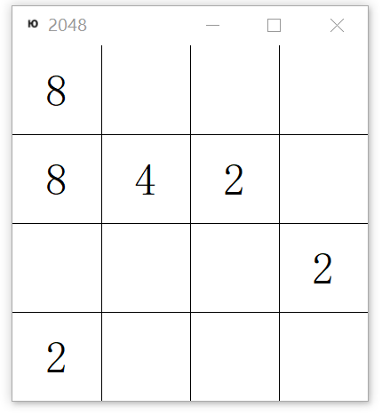

# Alpha2048
> Play 2048 Game with Artificial Intelligence

## Features
+ Home-made 2048 Game Engine



+ Reinforcement learning similar with Alpha Zero

## Requirements
+ Numpy
+ Keras,Tensorflow, Theano (For reinforcement learning)
+ PyQt5 (For UI)

## How to play
+ Human play:

    ```$python alpha2048/Game2048.py```

+ Machine training: (Coming soon)

## E-mail
longyang_123@yeah.net  
You're most welcome to contact with me to discuss any detail about this project